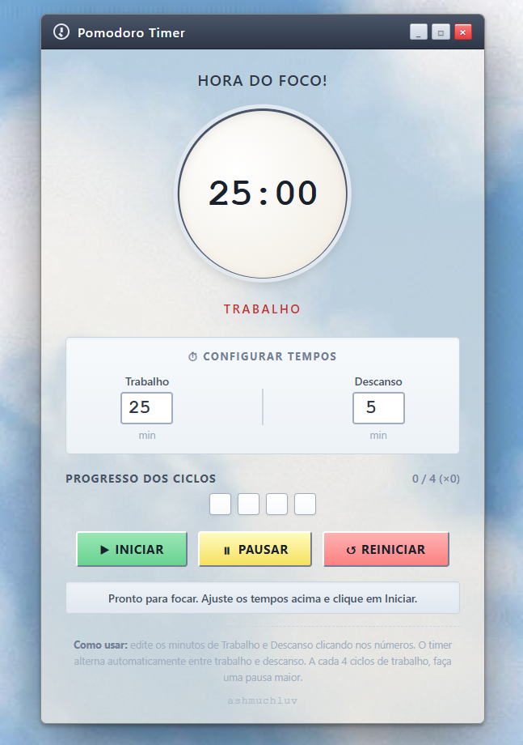

# ☁️ Cloud Pomodoro Timer

> "Foco estruturado com uma estética nostálgica."

Um cronômetro de produtividade baseado na Técnica Pomodoro, projetado com uma interface inspirada em janelas de sistemas operacionais clássicos (skeuomorphic/retro design). O projeto une lógica de programação em JavaScript puro com um cuidado minucioso na construção da identidade visual e experiência do usuário (UI/UX).

---

## 🚀 Funcionalidades

* **Configuração Dinâmica:** Ajuste customizável dos tempos de foco (Trabalho) e Pausa (Descanso) diretamente na interface.
* **Controle de Fluxo:** Opções completas de Iniciar, Pausar e Reiniciar o ciclo com feedbacks visuais claros.
* **Progresso de Ciclos:** Indicador visual em blocos para acompanhar a evolução das sessões de foco.
* **Log de Status:** Caixa de mensagens integrada que notifica o usuário sobre o estado atual do timer.
* **Design Responsivo & Temático:** Layout centralizado utilizando Flexbox, tipografia limpa e sombras realistas que simulam uma interface de sistema operacional desktop.

---

## 🎨 Diferenciais de UI/UX

Ao contrário de timers convencionais, este projeto foi desenhado pensando na experiência visual:
* **Foco na Identidade:** Estética retrô que equilibra nostalgia com a clareza de elementos modernos.
* **Acessibilidade Visual:** Botões com cores universais de ação (Verde para iniciar, Amarelo para pausar, Vermelho para resetar).
* **Microinterações:** Inputs numéricos nativos e limpos para facilitar a customização do tempo pelo usuário.

---

## 🔧 Acesse o projeto [Clicando Aqui](https://ashmuchluv.github.io/retro-pomodoro/)

  

